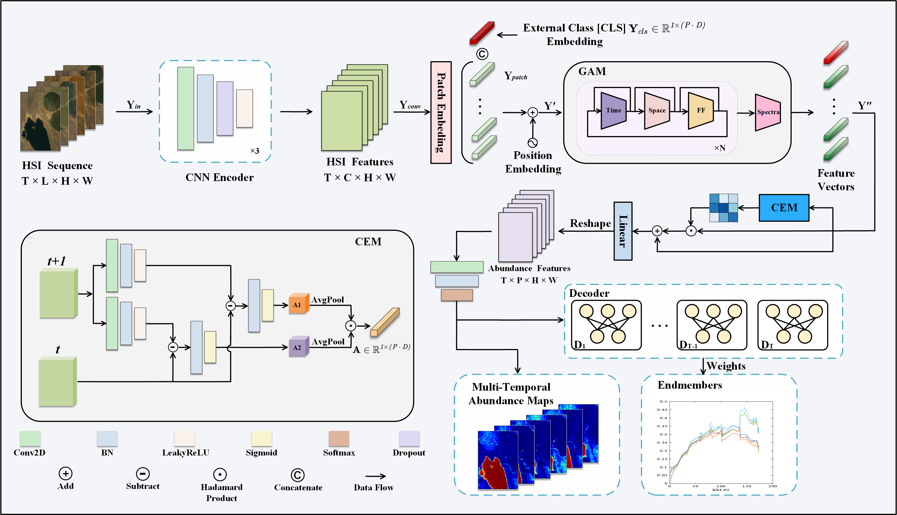

# MUformer

This is the repository for MUFormer(2025 TIP)).



## Abstract

Multitemporal hyperspectral image unmixing (MTHU) holds significant importance in monitoring and analyzing the dynamic changes of surface. However, compared to single-temporal unmixing, the multitemporal approach demands comprehensive consideration of information across different phases, rendering it a greater challenge. To address this challenge, we propose the Multitemporal Hyperspectral Image Unmixing Transformer (MUFormer), an end-to-end unsupervised deep learning model. To effectively perform multitemporal hyperspectral image unmixing, we introduce two key modules: the Global Awareness Module (GAM) and the Change Enhancement Module (CEM). The GAM computes self-attention across all phases, facilitating global weight allocation. On the other hand, the CEM dynamically learns local temporal changes by capturing differences between adjacent feature maps. The integration of these modules enables the effective capture of multitemporal semantic information related to endmember and abundance changes, significantly improving the performance of multitemporal hyperspectral image unmixing. We conducted experiments on one real dataset and two synthetic datasets, demonstrating that our model significantly enhances the effect of multitemporal hyperspectral image unmixing.

## Datasets && Env

The data set has been uploaded to Baidu web disk, and the link and extraction code are as follows:

链接：[https://pan.baidu.com/s/1u8vIAlYzrEMqr-7AafllKg?pwd=ft0v](https://pan.baidu.com/s/1u8vIAlYzrEMqr-7AafllKg?pwd=ft0v)

提取码：ft0v

To install the conda environment, please execute the following command:

```
conda env create -f muformer.yaml
```

## Train

The training codes for the three datasets can be referred to as Unmix-lake.ipynb,Unmix-syn1.ipynb, and Unmix-syn2.ipynb.

## Test

The realization of the model of assessment can consult ReDSUNN: [https://github.com/ricardoborsoi/ReDSUNN](https://github.com/ricardoborsoi/ReDSUNN "参考链接")

## Citation

If you find the code of our paper helpful to you, please quote the following content:

```plain
@article{li2025transformer,
  title={Transformer for multitemporal hyperspectral image unmixing},
  author={Li, Hang and Dong, Qiankun and Xie, Xueshuo and Xu, Xia and Li, Tao and Shi, Zhenwei},
  journal={IEEE Transactions on Image Processing},
  year={2025},
  publisher={IEEE}
}
```
